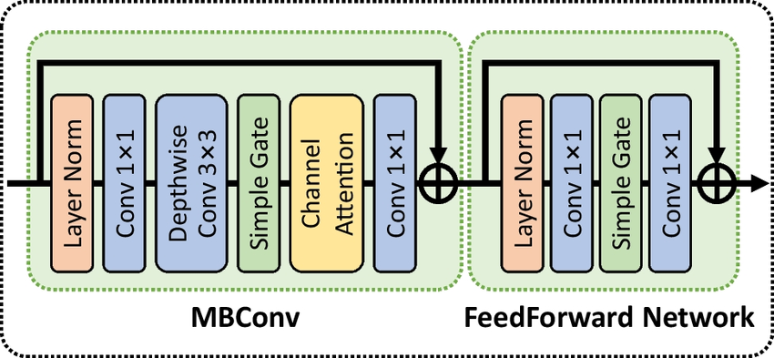

# SystemC TLM performance simulator of Nafblock in Nafnet
This subproject of performance simulator builds a simulator for a nafblock in Nafnet

The nafblock structure is shown in the image: 


## Status

> When making non-trivial changes, update this file's Status / Validated
> runs / Gotchas before finishing the task.


**v3 implemented** — standalone simulator drives all 14 nafblock sub-layers
through the shared `src/` + `kernel/` infrastructure, with per-sub-layer
int8 quantization epilogues now charged on every backend (see v3 update
below). No dependency on `nafnet/`.

### Build / run
```
make nafblock                 # builds nafblock/build/nafblock_perf_sim
make -C nafblock run          # runs with default shape
./nafblock/build/nafblock_perf_sim [--block-c N] [--block-h N] [--block-w N]
```
Defaults: `C=32, H=64, W=64`. Exit codes: `0`=PASS, `1`=bad CLI, `2`=verification failure.

### Files
- [nafblock_config.h](nafblock_config.h) — `N_WORKERS` and default tensor shape.
- [nafblock_layers.h](nafblock_layers.h) — `NafBlockLayerDesc`, per-op factory
  helpers, and **`append_nafblock_layers(layers, id, prefix, C, H, W)`** —
  the public entry point for embedding this block in a future NafNet driver.
- [nafblock_kernel_bridge.h](nafblock_kernel_bridge.h) — `LayerDesc → kernel runtime config`
  translators (one `nb_make_*_cfg` per backend).
- [nafblock_sim.cpp](nafblock_sim.cpp) — `LayerRunner` polymorphic hierarchy
  + `NafBlockTop` orchestrator + CLI + report.
- [Makefile](Makefile) — links `src/` + `kernel/*_top.o` + `nafblock_sim.o`.

### Architecture
- `LayerRunner` polymorphic hierarchy in [nafblock_sim.cpp](nafblock_sim.cpp)
  — one subclass per backend; `make_runner(layer)` dispatches on
  `layer.backend`.
- `VecOpsRunner` constructs one `VecOpsTop` **per phase** (driven by
  `nb_vecops_phases(layer)`) and runs them sequentially via per-phase
  `start_ev`/`done_ev`. Stats are accumulated across phases. Bridge is
  phase-aware: `nb_make_vecops_cfg(layer, op, phase_idx)` applies
  `secondary_*` shape overrides on `phase_idx == 1`.
- All other backends are single-phase (one `*Top` instance, one
  start/done pair).

### Operation → kernel mapping
| # | Sub-layer | Op | Backend (kernel) |
|---|-----------|----|------------------|
| 1 | `norm1`           | LayerNorm                       | `LayerNormTop` (γ·norm+β+clip in pass 3/4) |
| 2 | `conv1`           | 1×1 Conv (C→2C)                 | `MatmulTop` (built-in quant phase) |
| 3 | `conv2_dw`        | DW 3×3 Conv + i32→i8 requant    | `DwConvTop` (`requant_enabled=true`) |
| 4 | `simplegate1`     | Elem mul (2C→C) + i16→i8 requant| `VecOpsTop` (`VOP_ELEMWISE_MUL` → `VOP_QUANTIZE_I16_TO_I8`) |
| 5 | `sca_gap`         | Global Avg Pool                 | `PoolTop` (divide+clip in `POOL_DIVIDE_CYCLES`) |
| 6 | `sca_conv`        | 1×1 Conv (C→C) + i32→i8 requant | `VecOpsTop` (`VOP_DOT_PRODUCT_I8` → `VOP_QUANTIZE_I32_TO_I8`) |
| 7 | `sca_scale`       | Channel scale + i16→i8 requant  | `VecOpsTop` (`VOP_ELEMWISE_MUL` → `VOP_QUANTIZE_I16_TO_I8`) |
| 8 | `conv3`           | 1×1 Conv (C→C)                  | `MatmulTop` (built-in quant phase) |
| 9 | `beta_residual`   | (β·y)>>frac + skip              | `VecOpsTop` (`VOP_SCALE_REQUANT_I8` → `VOP_ELEMWISE_ADD`) |
|10 | `norm2`           | LayerNorm                       | `LayerNormTop` |
|11 | `conv4`           | 1×1 Conv (C→2C)                 | `MatmulTop` (built-in quant phase) |
|12 | `simplegate2`     | Elem mul (2C→C) + i16→i8 requant| `VecOpsTop` (`VOP_ELEMWISE_MUL` → `VOP_QUANTIZE_I16_TO_I8`) |
|13 | `conv5`           | 1×1 Conv (C→C)                  | `MatmulTop` (built-in quant phase) |
|14 | `gamma_residual`  | (γ·y)>>frac + skip              | `VecOpsTop` (`VOP_SCALE_REQUANT_I8` → `VOP_ELEMWISE_ADD`) |

### Quantization epilogues (v3, 2026-05-24)
Every sub-layer ends with an int8 quant step matching the reference C
([nafnet/nafnet_inference.c](../nafnet/nafnet_inference.c)). Cost accounting:

| Backend | Where the quant cycles come from |
|---|---|
| MATMUL    | `gemm_quant_vec_cycles` phase already inside `MatmulTop` |
| LAYERNORM | pass 3/4 (γ·norm + β + clip) inside `LayerNormTop` |
| POOLING   | `POOL_DIVIDE_CYCLES` (sum/N + clip) inside `PoolTop` |
| DWCONV    | one extra vec req per strip (`VOP_QUANTIZE_I32_TO_I8`, 6 insns), gated by `DwConvRuntimeConfig::requant_enabled` |
| VECOPS    | a second phase per layer (`VOP_QUANTIZE_I16_TO_I8` or `VOP_QUANTIZE_I32_TO_I8`); residual scale collapses into the new `VOP_SCALE_REQUANT_I8` (5 insns, fused i8·i16 >> frac + clip) |

### Validated runs (latest: 2026-05-24, v3)
- Default `C=32, H=W=64`: 14/14 layers + manifest PASS, total ≈**2.49 M cycles**.
- Custom `C=128, H=W=16`: 14/14 PASS; `sca_conv` row = 256 vec reqs × 2 phases.
- Standalone smoke checks (must stay green):
  - `./kernel/build/dw_conv2d_sim` — PASS with default `requant_enabled=false`.
  - `./kernel/build/vec_ops_sim --op scale_requant_i8` — PASS.
- Bad CLI (`--block-c 0`, unknown arg) → exit 1 with stderr error.

### Gotchas
- **DWCONV L1 req counting**: a single TLM vec request with `rd > 0` AND
  `wr > 0` charges **two** L1 requests in the memory model (read and
  write counted separately). `compute_expected` reflects this — the
  requant epilogue adds `2 × total_strips` to `expected_l1_reqs`.
- **`sca_conv` shape trick**: `nb_make_sca_conv` re-encodes `C_in` into
  `Hout` so the existing `nb_make_vecops_cfg` produces `channels=C,
  spatial=C` for the dot-product phase. Phase 2 (`VOP_QUANTIZE_I32_TO_I8`)
  would inherit the same `C × C` shape and over-count by `C×`, so
  `NafBlockLayerDesc::secondary_{Cout,Hout,Wout}` overrides re-shape it
  back to `1 × C × 1` for the requant phase.
- **DWCONV `requant_enabled` defaults OFF**: the standalone
  `dw_conv2d_sim` relies on this to keep its byte-exact verification.
  `nb_make_dwconv_cfg` flips it ON for nafblock. Don't change the default.
- **Adding a new VopType is additive**: extend the six `vop_*` switch
  helpers in [../kernel/vec_ops/vec_ops_config.h](../kernel/vec_ops/vec_ops_config.h)
  and register a name in [../kernel/vec_ops/main.cpp](../kernel/vec_ops/main.cpp).
  No changes to `vec_ops_top.cpp` needed — pattern used by both
  `VOP_DOT_PRODUCT_I8` (v2) and `VOP_SCALE_REQUANT_I8` (v3).
- **`nafnet/` is the legacy sim**, ignored by this subproject. Don't
  mirror changes there.
- **Manifest validator is strict**: `validate_nafblock_manifest` checks
  `(op_kind, backend, phase_count, primary_vop, secondary_vop)` per row.
  Any helper drift fails closed at sim startup.

### Parametric sweep (2026-05-21)
[parametric_sweep.py](parametric_sweep.py) mirrors the per-kernel sweep scripts.
Sweeps **block shape × hardware accelerator counts**, parses the simulator
report, and emits `parametric_sweep.csv` + `parametric_sweep.png`.

```
# default: 5 NAFNet32 shapes × default HW (mat=2,vec=4)
python3 nafblock/parametric_sweep.py

# multi-HW: 5 shapes × 3 HW configs (15 points, ~22 s wall)
python3 nafblock/parametric_sweep.py --hw "1:2,2:4,4:8"

# custom shapes (CxH list, H is also used for W)
python3 nafblock/parametric_sweep.py --shapes "32x64,64x32"
```

HW changes recompile via `EXTRA_CXXFLAGS=-DMAT_ACCEL_COUNT=...,VEC_ACCEL_COUNT=...`;
shape changes only re-run the binary. The Makefile passes `EXTRA_CXXFLAGS`
through every compile rule (added with the sweep script).

Plot has two panels: total elapsed cycles vs block shape (one line per HW),
and per-backend cycle breakdown stacked bars for the first HW configuration.
The CSV also records per-backend cycle / request totals so other plots are
straightforward to build from the same data.

### Integration note
The 14-layer composition is exposed through
`append_nafblock_layers(std::vector<NafBlockLayerDesc> &, int &id, const char *prefix, int C, int H, int W)`
in `nafblock_layers.h`. A future NafNet driver can loop this helper across
encoder / middle / decoder levels — no changes to the kernels or the bridge
are needed.

## Rules

- In 1*1 convolution, the weight matrix should be mapped as matrix A while input matrix as matrix B.